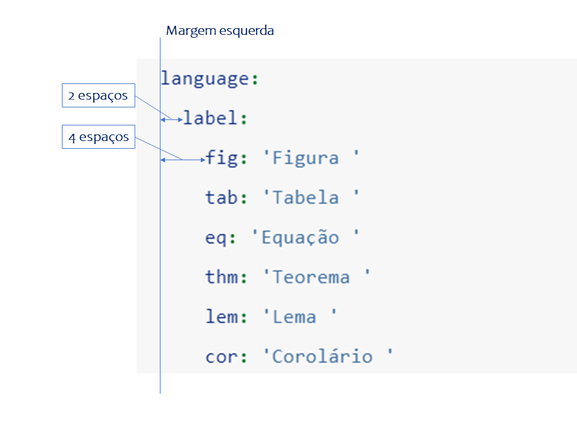

# O arquivo `_bookdown.yml` {#bkd}

Este é um exemplo do conteúdo do arquivo `_bookdown.yml`:

```yaml
book_filename: "ebook"
delete_merged_file: true
before_chapter_script: rm.R
after_chapter_script:
edit: https://github.com/joaobtj/curso-bookdownbr/edit/main/%s
view: https://github.com/joaobtj/curso-bookdownbr/blob/main/%s
output_dir: _book 
language:
  label:
    fig: 'Figura '
    tab: 'Tabela '
    eq: 'Equação '
    thm: 'Teorema '
    lem: 'Lema '
    cor: 'Corolário '
    prp: 'Proposição '
    cnj: 'Conjetura '
    def: 'Definição '
    exm: 'Exemple '
    exr: 'Exercício '
    hyp: 'Hipótese '
    proof: 'Prova '
    remark: 'Observação '
    solution: 'Solução '
  ui:
    edit: 'Editar '
    chapter_name: 'Capítulo '
    appendix_name: 'Apêndice '

```


* `book_filename`: nome do arquivo gerado (Rmd, PDF, ePub, etc)

* `delete_merged_file`: deleta o arquivo Rmd depois de livro ser renderizado com sucesso

* `before_chapter_script` and `after_chapter_script`: um ou mais *scripts* em R a serem executados antes (*before*) ou depois (*after*) de cada capítulo. 

* `edit`: um link para colaboradores poderem editar o arquivo fonte do documento. Comumente é um repositório Git (GitHub ou GitLab). O link deve finalizar com `%s`.

* `view`: semelhante ao `edit`, um link para visualizar o arquivo fonte.

* `output_dir`: diretório onde será renderizado o livro. Veja mais no Capítulo \@ref(githubpages).

* `new_session`: usar uma sessão nova do R ara compilar cada arquivo Rmd individualmente. 

* `language`: permite a tradução de termos para o idioma desejado. 

Muito cuidado com a [indentação ](https://pt.wikipedia.org/wiki/Indenta%C3%A7%C3%A3o) na formatação do arquivo. Cada nível deve ser iniciado com 2 espaços, por exemplo, `language` inicia na margem esquerda do arquivo. `label` inicia a dois espaços da mergem. `fig` inicia a 4 espaços da margem (dois a mais que `label`).

(ref:ident-bookdown) Exemplo de indentação no arquivo `_bookdown.yml`.

```{r ident-bookdown, fig.cap="(ref:ident-bookdown)", out.width="400pt", echo=FALSE}



```
